<p align="center">
  
</p>

<p align="center">一款基于Tauri、Vite 7、Vue 3 和 TypeScript 构建的即时通讯系统</p>

<div align="center">
  <a href="https://trendshift.io/repositories/15187" target="_blank">
    
  </a>
  <a href="https://hellogithub.com/repository/743b101346c54f6cb5c20eed2edbaa40" target="_blank">
    
  </a>
</div>

<br>

<div align="center">
  <p>
    <a href="https://gitee.com/llangkebo/hula/stargazers">
      
    </a>
    <a href="https://gitee.com/llangkebo/hula/stargazers">
      
    </a>
    <a href="https://gitcode.com/llangkebo/hula">
      
    </a>
    <a href="https://gitcode.com/llangkebo/hula">
      
    </a>
  </p>
</div>

<br>

<div align="center">
  <p>
    <a href="https://deepwiki.com/HuLaSpark/HuLa">
      
    </a>
    <a href="https://app.fossa.com/projects/git%20Bgithub.com%20FHuLaSpark%20FHuLa?ref=badge_shield">
      
    </a>
    <a href="https://www.bestpractices.dev/zh-CN/projects/9692">
      
    </a>
    <a href="https://hulaspark.com">
      
    </a>
    <a href="https://discord.gg/WhSkvhNEeE">
      
    </a>
  </p>
</div>

<br>

<div align="center">
  <h3>🔗 快速链接</h3>
  <p>
    💻 <strong>官网：</strong><a href="https:matrixhulasparcom">HuLaSpark</a> |
    📝 <strong>启动文档：</strong><a href="docs/project_guide.md">环境配置及其启动教程</a> |
    💬 <strong>服务端：</strong><a href="https://github.com/langkebo/synapse-rust">synapse-rust</a> |
    📱 <strong>微信：</strong><code>cy2439646234</code>
  </p>
</div>

<p align="center">
  中文 |
  <a href="README.en.md">English</a> |
</p>

## 🌐 支持平台

| 平台    | 支持版本                                                              |
| ------- | --------------------------------------------------------------------- |
| Windows | Windows 10, Windows 11                                                |
| macOS   | macOS 10.5+ Mac12已支持                                               |
| Linux   | Ubuntu 22.0+                                                          |
| iOS     | iOS 9.0+ (iOS 16真机已支持，Tauri不支持Intel芯片在iOS 16模拟器上运行) |
| Android | Android 12+ (SDK 30+)                                                  |
| Web     | ⚠️ 暂不支持(需要自定义移除对桌面功能)                                  |

## 📝 项目介绍

HuLa 是一款基于 Tauri、Vite 7、Vue 3 和 TypeScript 构建的即时通讯系统。它利用了 Tauri 的跨平台能力和 Vue 3 的响应式设计，结合了 TypeScript 的类型安全特性和 Vite 7 的快速构建，为用户提供了一个高效、安全和易用的通讯解决方案。

### 核心技术架构

HuLa 采用三层架构设计，确保高性能与可维护性：

| 层级 | 技术 | 说明 |
|------|------|------|
| **前端应用** | Tauri + Vue 3 + TypeScript | 跨平台桌面/移动应用 |
| **SDK 层** | matrix-js-sdk (本地) | Matrix 协议封装与扩展 |
| **后端服务** | synapse-rust | Rust 编写的 Matrix Homeserver |

### 后端对接

HuLa 通过集成本地 [matrix-js-sdk](https://github.com/langkebo/matrix-js-sdk) 实现与 [synapse-rust](https://github.com/langkebo/synapse-rust) 后端的完整对接：

- **Matrix Client API**: 标准 Matrix 协议接口，覆盖认证、房间、消息、媒体等核心能力
- **synapse-rust 扩展**: Rust 后端特有的增强功能，包括好友关系、Widget、语音消息等
- **throwOnError 模式**: 遵循 SDK 错误处理规范，读取操作默认抛出异常，确保错误可观测性

详细 API 契约请参考 [matrix-js-sdk API 契约文档](./matrix-js-sdk/docs/api-contract/)。

## 🛠️ 技术栈

- **Tauri**: 为本项目提供了一款轻量级的、高性能的桌面应用容器，使得我们可以使用前端技术栈来开发跨平台的桌面应用。Tauri 的设计哲学是在保证安全性的前提下，尽可能减少资源占用。
- **Vite 7**: Vite 是一个现代化的前端构建工具，它利用原生 ES 模块导入的能力来提供一个快速的开发服务器，与此同时，它也为生产环境打包提供了强大的支持。Vite 7 是其最新的版本，带来了更多的优化和特性。
- **Vue 3**: Vue 3 是一个渐进式JavaScript框架，用于构建用户界面。它的组合式API、更好的TypeScript集成和对移动端的优化使得开发复杂的单页应用变得更加简单和高效。
- **TypeScript**: TypeScript 是 JavaScript 的一个超集，它在 JavaScript 的基础上增加了类型系统。这让我们能够在开发过程中捕获更多的错误，并且提供更好的编辑器支持。

## 📖️ 项目预览

<div align="center">
  <h3>🎨 界面展示</h3>
</div>

<div align="center">
  <h4>PC端界面展示，请自行下载体验 🙏</h4>
</div>

<div align="center">
  
  
  
  
  
</div>

<br/>

<div align="center">
  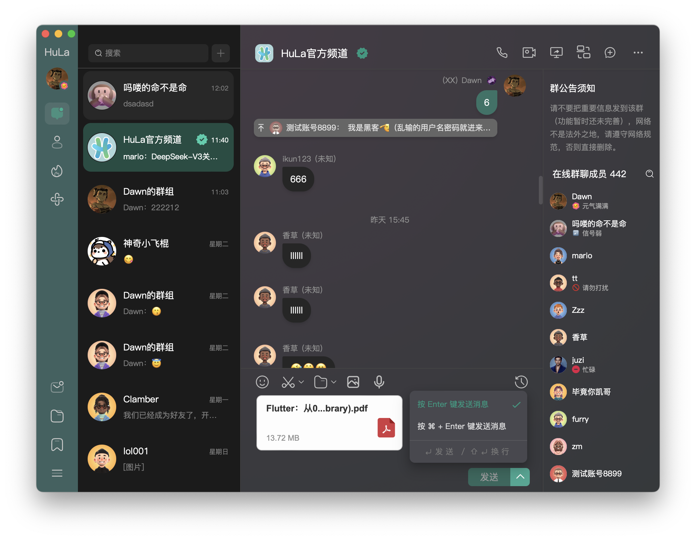
  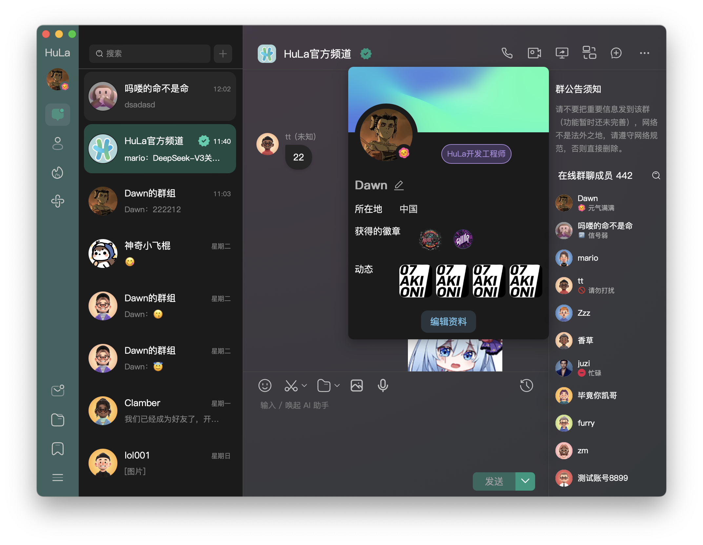
  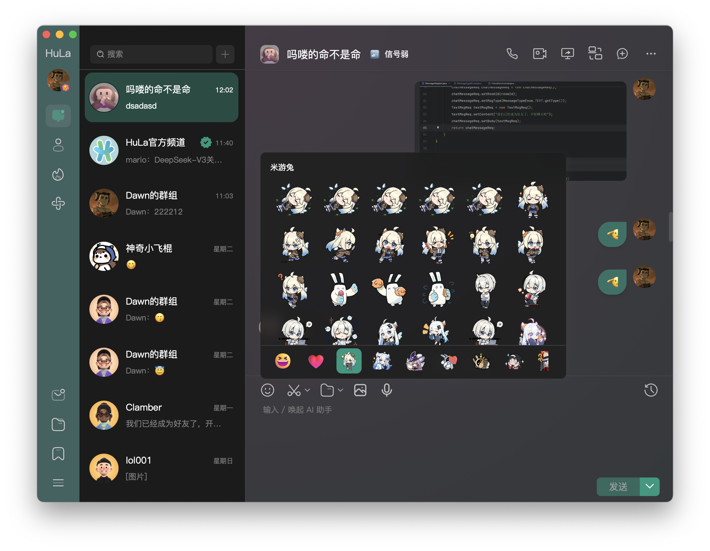
  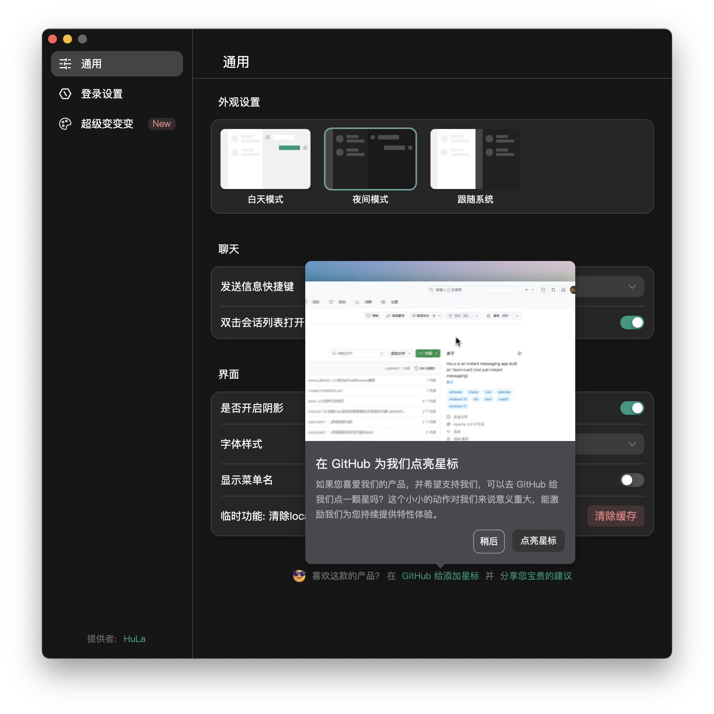
  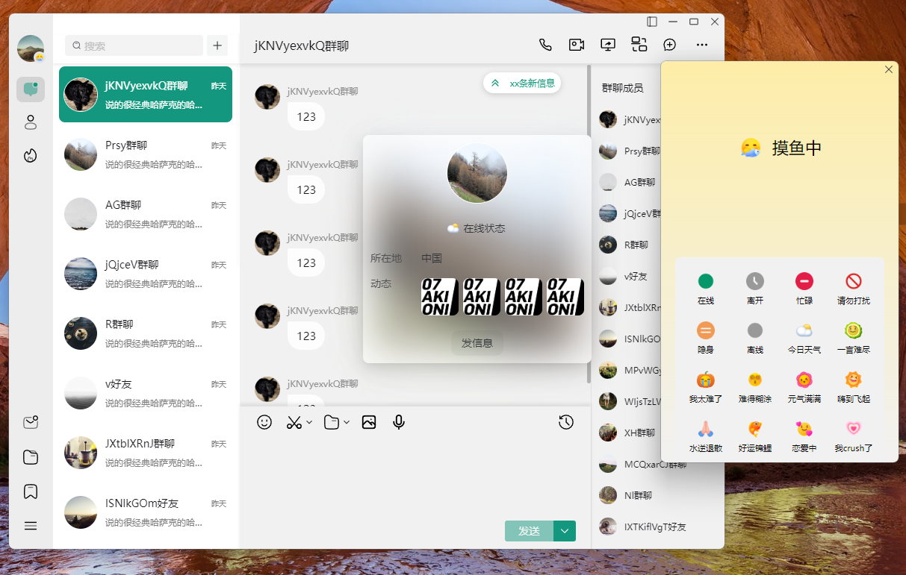
  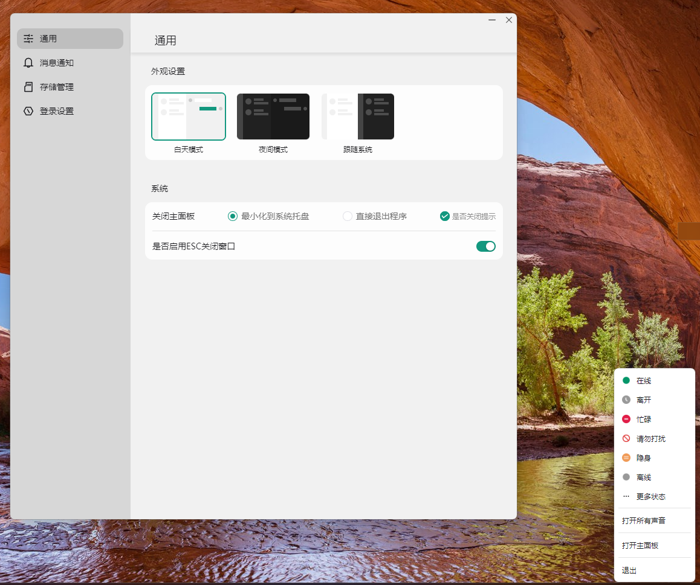
  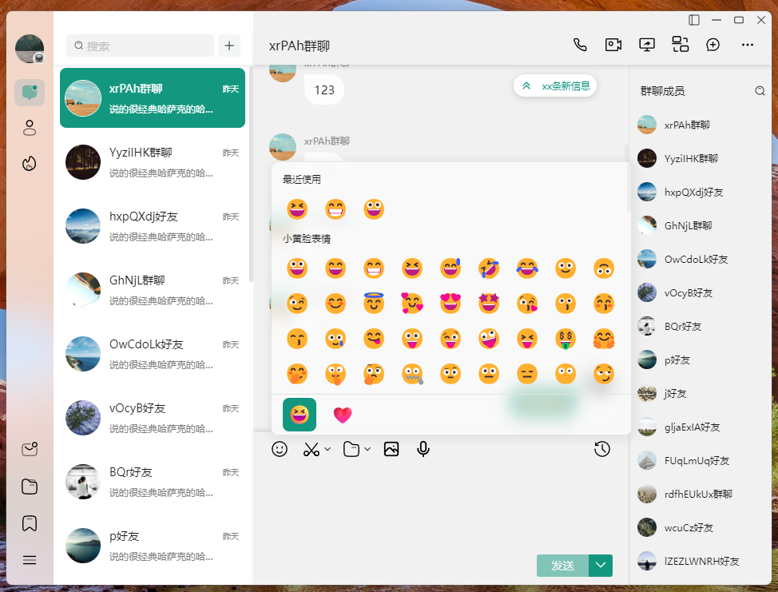
  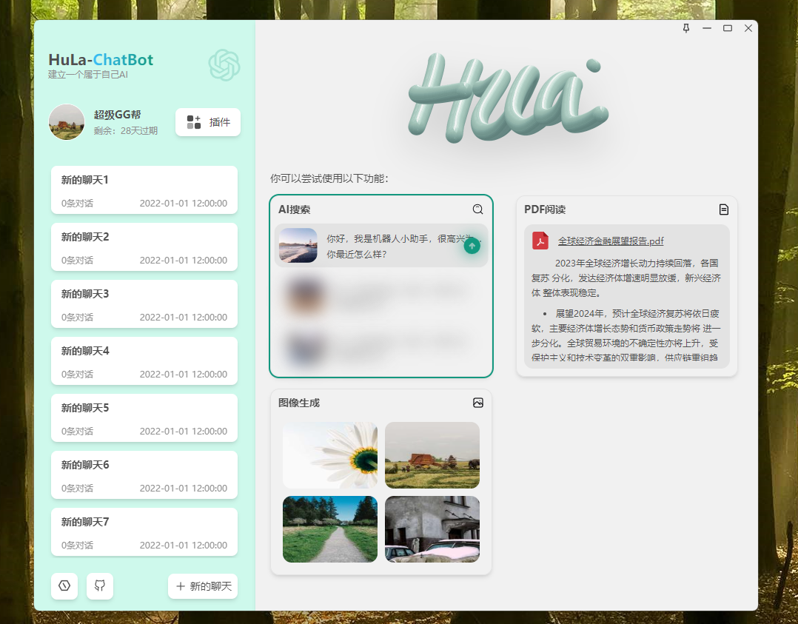
  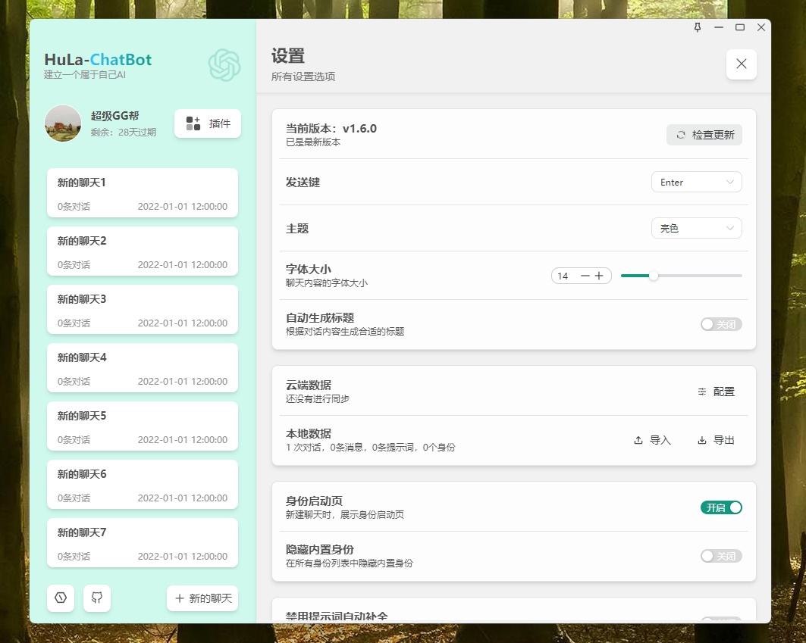
  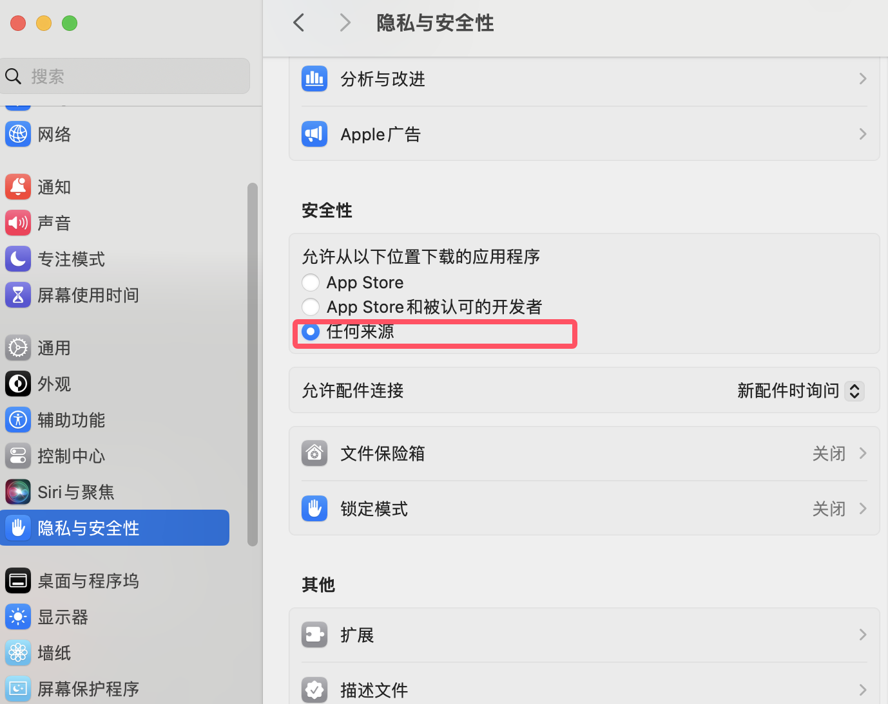
</div>

<div align="center">
  <h4>移动端界面展示</h4>
</div>

<div align="center">
  
  
  
  
  
  
  
</div>

<br/>

## 📥 安装与运行

```bash
# 克隆项目
git clone https://gitee.com/llangkebo/hula.git
或者
git clone https://gitee.com/llangkebo/hula.git

# 进入项目目录
cd HuLa

# 安装依赖
pnpm install

# 运行开发服务器
pnpm run tauri:dev

# 构建生产版本
pnpm run tauri:build
```

## ⚠️ 注意事项

1. **本地 SDK 集成**: 项目使用 `link:../matrix-js-sdk` 方式集成本地 Matrix SDK，通过该 SDK 实现与 synapse-rust 后端的完整对接
2. **后端服务**: 项目对接 [synapse-rust](https://github.com/HuLaSpark/synapse-rust) 作为 Matrix Homeserver，支持标准 Matrix 协议及 Rust 后端扩展能力
3. **API 契约遵循**: 所有 SDK 调用遵循 [matrix-js-sdk API 契约](./matrix-js-sdk/docs/api-contract/) 中的 throwOnError 错误处理模式
4. **依赖管理**: 使用 pnpm 作为包管理器
5. **类型检查**: 运行 `pnpm vue-tsc --noEmit` 进行类型检查
6. **代码规范**: 遵循 `.trae/rules/project_rules.md` 中的规范
7. **开发环境**: 需同时运行 hula、matrix-js-sdk 和 synapse-rust 三个项目

## 📋 提交规范

执行 **pnpm run commit** 启动 _git commit_ 交互，根据提示完成信息的输入和选择

## ⚖️ 免责声明

1. 本项目是作为一款开源项目提供的，开发者在法律允许的范围内不对软件的功能性、安全性或适用性提供任何形式的明示或暗示的保证。
2. 用户明确理解并同意，使用本软件的风险完全由用户自己承担，软件以"现状"和"现有"基础提供。开发者不提供任何形式的担保，无论是明示还是暗示的，包括但不限于适用性、特定用途的适用性和非侵权的担保。
3. 在任何情况下，开发者或其供应商都不对任何直接的、间接的、偶然的、特殊的、惩罚性的或后果性的损害承担责任，包括但不限于使用本软件产生的利润损失、业务中断、个人信息泄露或其他商业损害或损失。
4. 所有在本项目上进行二次开发的用户，都需承诺将本软件用于合法目的，并自行负责遵守当地的法律和法规。
5. 开发者有权在任何时间修改软件的功能或特性，以及本免责声明的任何部分，并且这些修改可能会以软件更新的形式体现。

**本免责声明的最终解释权归开发者所有**

## 🎁 支持项目

<h3>💝 赞助支持</h3>
<p><em>如果您觉得 HuLa 对您有帮助，欢迎赞助支持，您的支持是我们不断前进的动力！</em></p>

<div>
  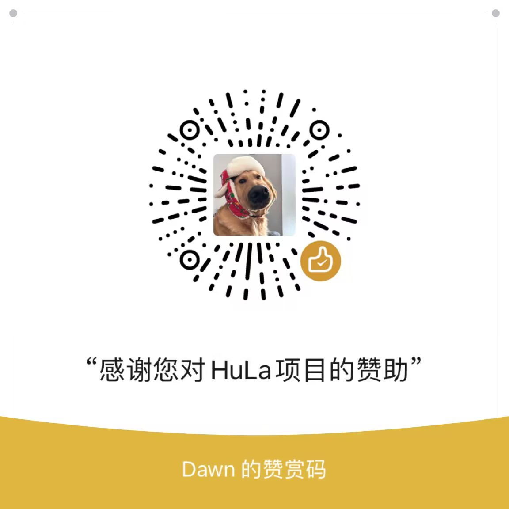
  
</div>

<br/>

## 💬 加入社区

<div align="center">
  <h3>🤝 HuLa 社区讨论群</h3>
  <p><em>与开发者和用户一起交流讨论，获取最新资讯和技术支持</em></p>
  <p><em>使用 HuLa 移动端扫码加入下方 Issues 群，第一时间反馈问题与建议。</em></p>
  <div style="display: flex; justify-content: center; gap: 20px; flex-wrap: wrap;">
    
    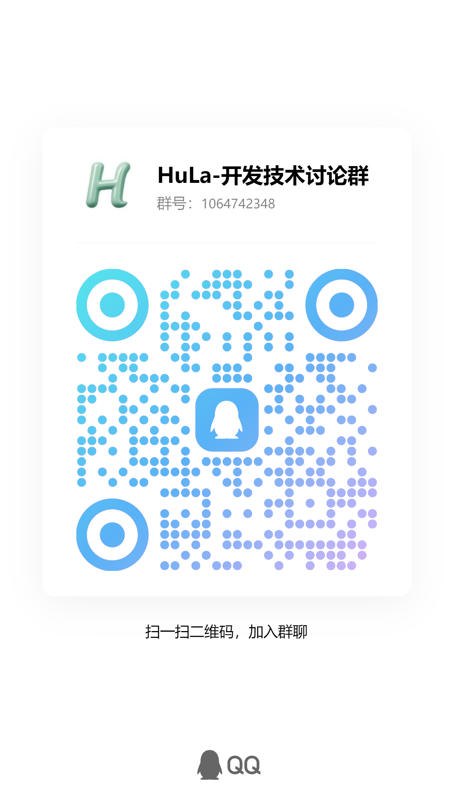
    
  </div>
</div>

---

<div align="center">
  <p><strong>让我们一起构建更好的即时通讯体验 🚀</strong></p>
</div>
